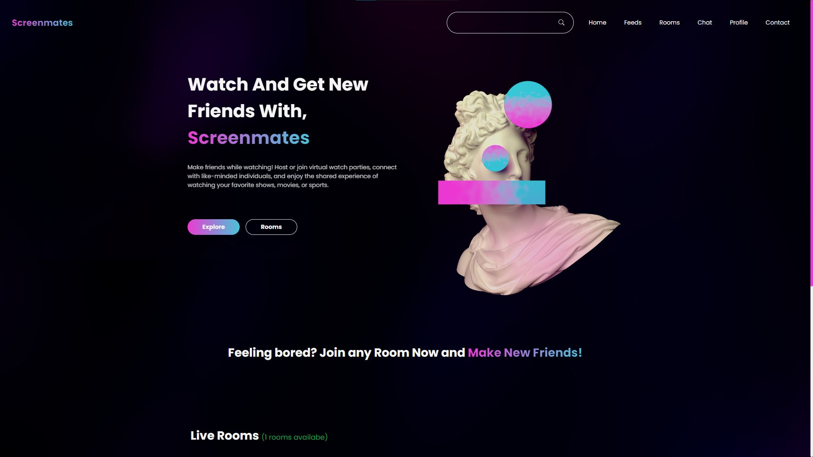
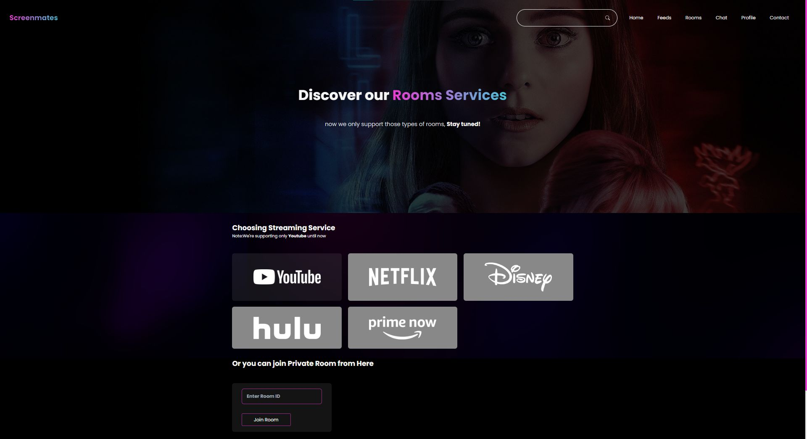
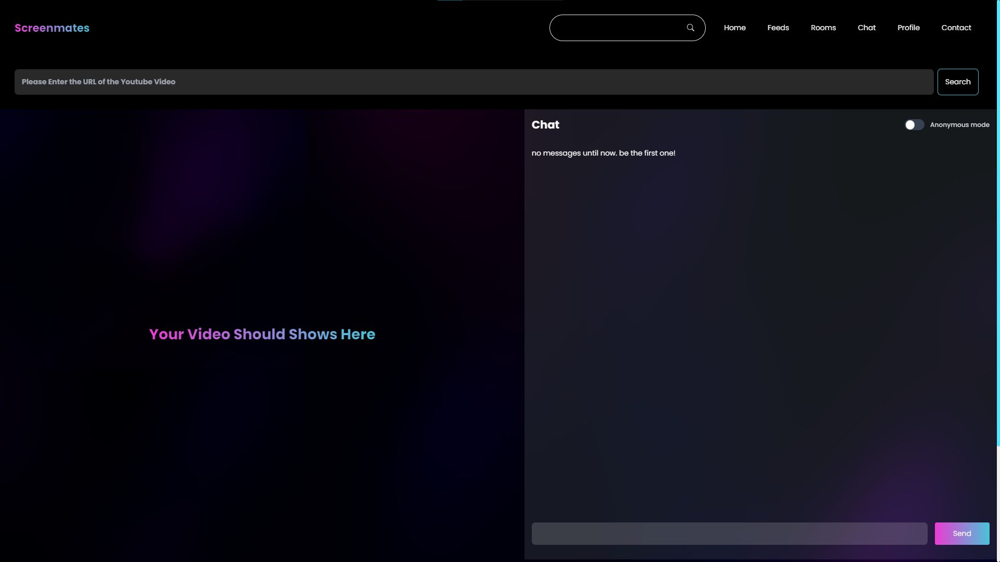

<h1 align='center'>ScreenMates</h1>

<p align="center">
  
</p>
<h2>Demo</h2>

🔥 [Live Demo](https://screenmates-beta-v.onrender.com/)

<h2>Built with</h2>

<h3>Front-End</h3>

- React
- socket io
- Tailwind CSS
- cloudinary for images/videos

<h3>Back-End</h3>

- Node.js
- Express
- MongoDB
- Socket Io

</br>

<h1>What is the ScreenMates 🌐</h1>
<p>ScreenMates is your go-to destination for real-time watch-along rooms, where you can share reactions, connect with friends, and receive instant notifications – all in a seamless and immersive environment</p>


<h2>🚀 Key Features</h2>

✅ Real-time Watch Together Rooms
✅ Random and Private chats and rooms
✅ Create new posts (Images, videos, text)
✅ React to Friends' Posts
✅ Make Comments on Friends' Posts
✅ Real-time Notifications
✅ Make New Friends within the Platform

</br>

<h2>Screenshots</h2>






</br>

<h2>Development</h2>

Here are the steps to start the project locally.

1. Clone the repository (Frontend Side)

```sh
HTTPS - $ git clone https://github.com/minamelad33333/screenmates.git
```

3. Install the dependencies.

```sh
$ npm i
```


```sh
$ npm run dev
```
